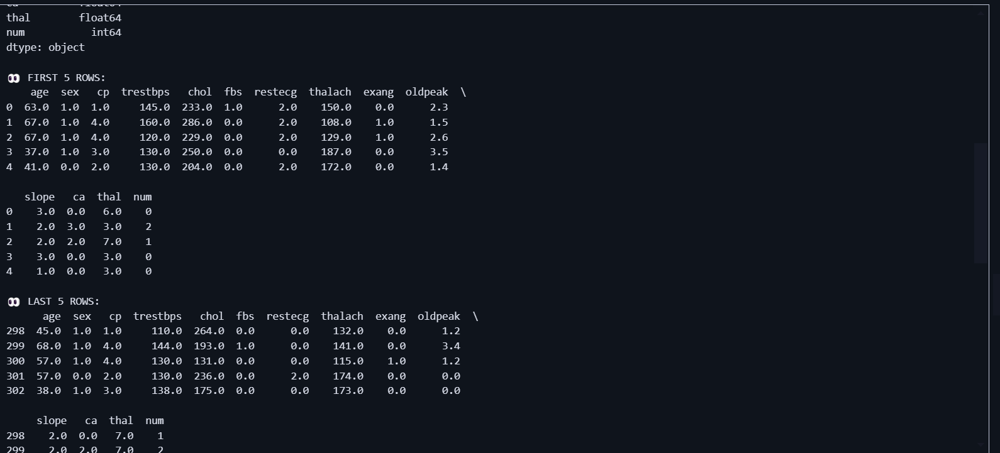
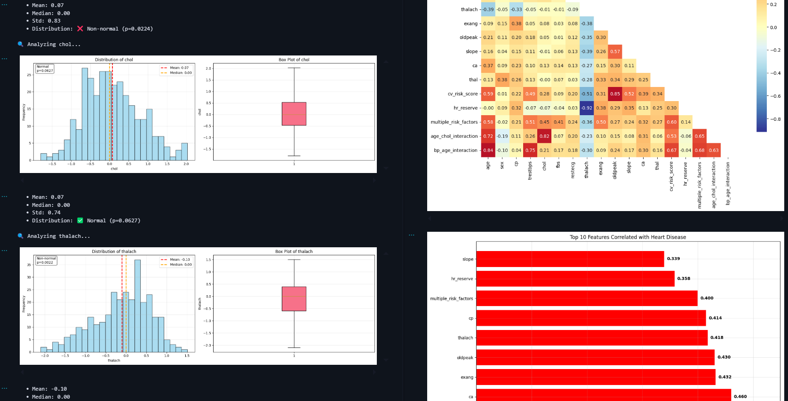

# Heart Disease Prediction - Capstone Project

### Student: Tricia Nshuti 
### Course: INSY 8413 - Introduction to Big Data Analytics  
### Dataset: UCI Heart Disease Dataset  

---

## Table of Contents
1. [Project Overview](#project-overview)  
2. [Dataset Description](#dataset-description)  
3. [Initial Data Exploration](#initial-data-exploration)  
4. [Data Preprocessing & Feature Engineering](#data-preprocessing--feature-engineering)  
5. [Exploratory Data Analysis (EDA)](#exploratory-data-analysis-eda)  
6. [Machine Learning Modeling (Upcoming)](#machine-learning-modeling-upcoming)  
7. [How to Run the Project](#how-to-run-the-project)  
8. [Screenshots & Visualizations](#screenshots--visualizations)  
9. [Future Work](#future-work)  

---

## Project Overview

This capstone project aims to develop a robust predictive model to identify patients at risk of heart disease using the UCI Heart Disease dataset. The project follows a comprehensive data science pipeline:

- Data acquisition and initial exploration  
- Advanced preprocessing and cleaning  
- Feature engineering informed by clinical knowledge  
- Exploratory data analysis for insights  
- (Upcoming) Machine learning modeling and evaluation  

The goal is to build a reliable binary classifier distinguishing heart disease presence or absence to assist clinical decision-making.

---

## Dataset Description

- **Source:** UCI Heart Disease Dataset  
- **Size:** 303 patient records  
- **Features:** 14 clinical and demographic variables (e.g., age, sex, chest pain type, resting blood pressure)  
- **Target:** `num` (0 = no disease, 1-4 indicate presence/severity) converted to binary (0 vs 1) for modeling  

### Variables Include:

| Feature       | Description                         | Type       |
|---------------|-----------------------------------|------------|
| age           | Age in years                      | Numeric    |
| sex           | Gender (1 = male, 0 = female)     | Binary     |
| cp            | Chest pain type (1-4)             | Ordinal    |
| trestbps      | Resting blood pressure (mm Hg)     | Numeric    |
| chol          | Serum cholesterol (mg/dl)          | Numeric    |
| fbs           | Fasting blood sugar > 120 mg/dl (1 = true; 0 = false) | Binary |
| restecg       | Resting electrocardiographic results (0-2) | Ordinal |
| thalach       | Maximum heart rate achieved        | Numeric    |
| exang         | Exercise induced angina (1 = yes; 0 = no) | Binary |
| oldpeak       | ST depression induced by exercise | Numeric    |
| slope         | Slope of the peak exercise ST segment (1-3) | Ordinal |
| ca            | Number of major vessels (0-3)      | Numeric (with missing) |
| thal          | Thalassemia (3 = normal; 6,7 = defects) | Categorical (with missing) |
| num           | Diagnosis of heart disease (0-4)  | Ordinal    |

---

## Initial Data Exploration

The dataset was first loaded and basic descriptive statistics were computed to understand its structure, data types, and presence of missing values.

- **Shape:** 303 rows × 14 columns  
- **Missing values:** Present in 'ca' (4 missing) and 'thal' (2 missing)  
- **Target distribution:**  
  - No heart disease (0): 164 patients (54.1%)  
  - Heart disease (1-4): 139 patients (45.9%)  

### Summary statistics highlight typical ranges and variability in features such as age, blood pressure, cholesterol, and heart rate.

### Initial Dataset Overview  


---

## Data Preprocessing & Feature Engineering

### Missing Values Treatment
- Imputed missing values in `ca` with 0 for both healthy and diseased groups, based on domain knowledge.  
- Applied K-Nearest Neighbors (KNN) imputation for `thal` using correlated features.

### Outlier Treatment
- Outliers capped based on clinical thresholds for features: `trestbps`, `chol`, `thalach`, `oldpeak`.  
- No outliers detected for age.

### Feature Engineering
- Created **7 new features**:
  - Age risk categories (Low, Medium, High, Very High)  
  - Cardiovascular risk score combining key indicators  
  - Blood pressure risk categories  
  - Cholesterol risk levels  
  - Heart rate reserve  
  - Multiple risk factors indicator (binary)  
  - Interaction terms (e.g., age × cholesterol)

### Encoding and Scaling
- Applied appropriate encoding:  
  - Binary encoding (sex, fbs, exang)  
  - Ordinal encoding (cp, restecg, slope, thal)  
  - One-hot encoding for categorical risk categories  
- Feature scaling using RobustScaler for skewed features and StandardScaler for normally distributed engineered features.

### Final dataset shape: 303 rows × 31 features (original + engineered)

### Missing Values Treatment  
  

### Outlier Treatment Visualization  
  

### Feature Engineering Summary  
  

---

## Exploratory Data Analysis (EDA)

Conducted detailed analyses to identify feature distributions, relationships, and associations with heart disease:

- Visualized numerical feature distributions with histograms and boxplots.  
- Analyzed categorical variables against target using bar plots.  
- Computed Pearson correlations and plotted heatmap to identify multicollinearity.  
- Compared clinical variables between healthy and diseased groups via statistical tests and boxplots.

**Key Findings:**
- Significant differences in age, trestbps, chol, and thalach between groups.  
- Strong association between chest pain type (cp) and heart disease presence.  
- Certain engineered features show promising predictive potential.

### Correlation Heatmap  


### Group Comparison Boxplots  


---

## Machine Learning Modeling (Upcoming)

The next phase involves:

- Building and tuning classification models (e.g., Logistic Regression, Random Forest, XGBoost).  
- Evaluating models with metrics: accuracy, precision, recall, F1-score, ROC-AUC.  
- Performing cross-validation and hyperparameter tuning.  
- Preparing final model for deployment.


---

## How to Run the Project

1. **Clone the repository:**  
   ```bash
   git clone https://github.com/Nshutitricia/heart-disease-prediction.git
   cd heart-disease-prediction
   ```
2. Access PowerBi  : [powerBi File](/heart_disease.pbix)


Refer to the PDF File for more visuals.

## Future Work

-Develop and optimize machine learning models for heart disease classification.

-Incorporate model explainability techniques (SHAP, LIME).

-Deploy a web application for real-time risk prediction.

-Expand dataset with external sources for generalization.